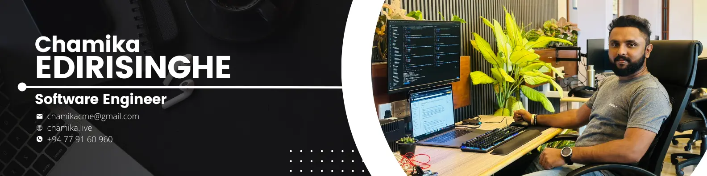

<h1 align="center">Hi 👋, I'm Chamika Edirisinghe</h1>
<h3 align="center">Full-Stack Software Engineer 🚀</h3>

  
  
  

  Full-Stack Software Engineer building scalable, user-centric web & mobile applications.  
  I focus on banking automation, process optimization, and transforming ideas into digital reality.

  

 

## ⚡ About Me

- 🔭 I’m currently working on **Automation Solutions** and **Financial Systems**.
- 🌱 I’m currently exploring **Advanced Cloud Architecture** and **Microservices**.
- 🎓 Graduated with **BSc Engineering Honors** from University of Moratuwa.
- 💬 Experienced in **Node.js, Spring Boot, React, Next.js, Flutter, and AWS**.
- 👨‍💻 Get to know more about me at [chamikacme.com](https://chamikacme.com)
- 📫 Reach me at: **chamikacme@gmail.com**

 

## 🛠 Capabilities & Tech Stack

### 💻 Languages

  
  
  
  
  

### 🎨 Frontend

  
  
  
  
  
  
  

### ⚙️ Backend

  
  
  
  

### ☁️ Infrastructure & Databases

  
  
  
  
  
  
  

### 🧰 Tools & Others

  
  
  
  
  

 

## 🌐 Connect with Me

  
  
  
  
  
  

